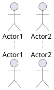
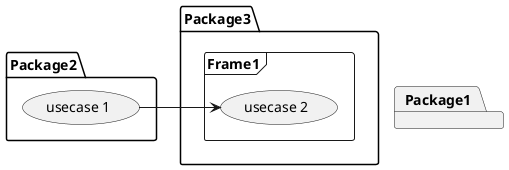
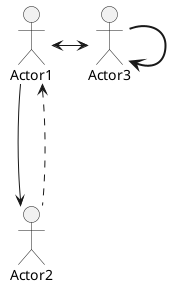
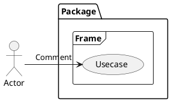
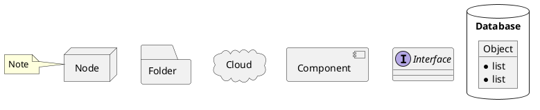

PlantUMLを使うときによく使う機能を忘れがちなので、個人用にまとめました。

## 人を追加する

```plantuml
@startuml
actor Actor1 as ac1
actor Actor2 as ac2
@enduml
```

## 大枠を追加

```plantuml
@startuml
package Package1

package Package2 {
  usecase "usecase 1" as u1
}

package Package3 {
  frame Frame1 {
    usecase "usecase 2" as u2
  }
}

u1 -> u2
@enduml
```

## 関係を追加

```plantuml
@startuml
actor Actor1 as act1
actor Actor2 as act2
actor Actor3 as act3

act1 --down-> act2
act1 <-right-> act3

act2 ..up.> act1

act3 => act3
@enduml
```

## 関係にコメントを追加

```plantuml
@startuml
actor Actor as act

package Package {
  frame Frame {
    usecase Usecase
  }
}

act -> Usecase : Comment
@enduml
```

## 便利な図形

```plantuml
@startuml

database Database {
  object Object {
    * list
    * list
  }
}

node Node {

}

folder Folder {

}

cloud Cloud {

}

interface Interface {

}

component Component {

}

note left of Node : Note
@enduml
```
